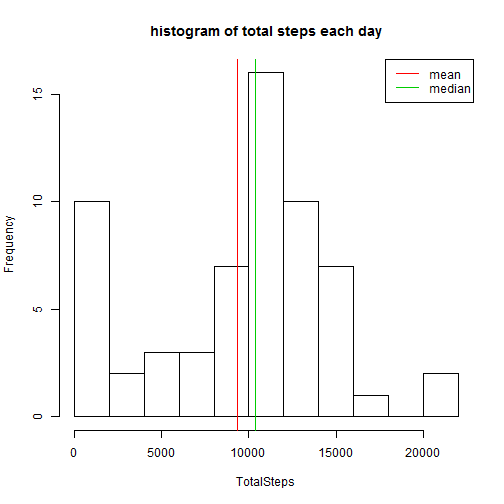
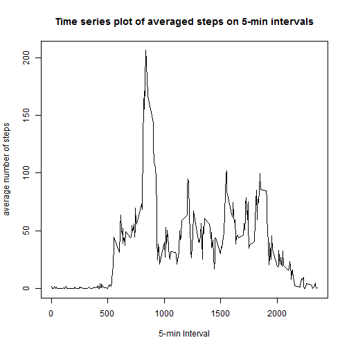
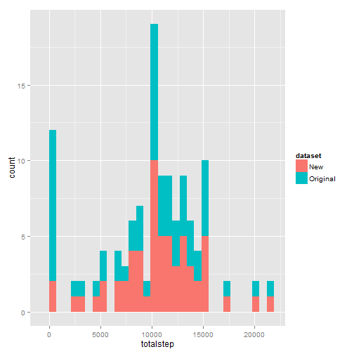
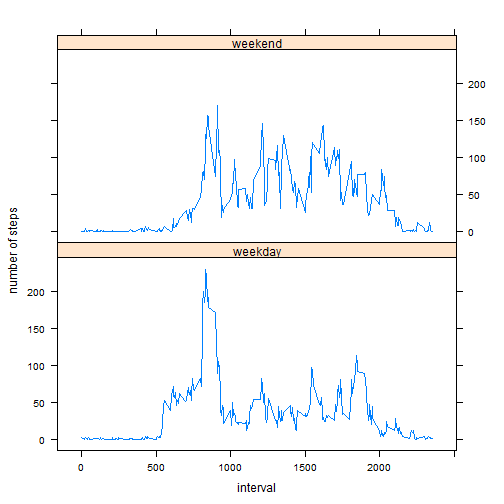

Peer Assignment 1
============================================

### Step 1 Loading and preprocessing the data


```r
temp = tempfile()
download.file("http://d396qusza40orc.cloudfront.net/repdata%2Fdata%2Factivity.zip", temp)
data = read.csv(unz(temp, "activity.csv"))
head(data)
```

```
##   steps       date interval
## 1    NA 2012-10-01        0
## 2    NA 2012-10-01        5
## 3    NA 2012-10-01       10
## 4    NA 2012-10-01       15
## 5    NA 2012-10-01       20
## 6    NA 2012-10-01       25
```

```r
##   steps       date interval
## 1    NA 2012-10-01        0
## 2    NA 2012-10-01        5
## 3    NA 2012-10-01       10
## 4    NA 2012-10-01       15
## 5    NA 2012-10-01       20
## 6    NA 2012-10-01       25
```

### Step 2 What is mean total number of steps taken per day?
#### 1.Make a histogram of the total number of steps taken each day

```r
newdata = na.omit(data)
NumOfDate = length(levels(newdata$date))
TotalSteps = rep(0,NumOfDate)
for(i in 1:NumOfDate)
{
  Date = levels(newdata$date)[i]
  SubNewData = subset(newdata,newdata$date==Date)
  TotalSteps[i] = sum(SubNewData$steps)
}
```
The histogram is shown below.

```r
hist(TotalSteps,breaks = 10,main="histogram of total steps each day")
abline(v=c(mean(TotalSteps),median(TotalSteps)),col=2:3)
legend("topright",c("mean","median"),col=2:3,lty=1)
```

 

#### 2.Calculate and report the mean and median total number of steps taken per day

```r
MM = data.frame(mean(TotalSteps),median(TotalSteps))
colnames(MM)=c("Mean","Median")
MM
```

```
##   Mean Median
## 1 9354  10395
```

```r
##   Mean Median
## 1 9354  10395
```

### Step 3 What is the average daily activity pattern?
#### 1.Make a time series plot
First produce a time series plot of the 5-minute interval and the average number of steps taken, averaged across all days.

```r
newdata$Interval = as.factor(newdata$interval)
NumOfInterval = length(levels(newdata$Interval))
AveSteps = rep(0,NumOfInterval)
for(i in 1:NumOfInterval)
{
  targetInterval = levels(newdata$Interval)[i]
  SubNewData = subset(newdata,newdata$Interval == targetInterval)
  AveSteps[i] = mean(SubNewData$steps)
}
plot(levels(newdata$Interval),AveSteps,type = "l",
     xlab = "5-min Interval",ylab="average number of steps",
     main = "Time series plot of averaged steps on 5-min intervals")
```

 

#### 2.Which 5-minute interval, on average across all the days in the dataset, contains the maximum number of steps?

```r
levels(newdata$Interval)[which(AveSteps==max(AveSteps))]
```

```
## [1] "835"
```

```r
## [1] "835"
```
### Step 4 Imputing missing values
#### 1.Calculate and report the total number of missing values in the dataset.

```r
nrow(data)-nrow(newdata)
```

```
## [1] 2304
```

```r
## [1] 2304
```

#### 2&3.Devise a strategy for filling in all of the missing values in the dataset.
Here I use K Nearest Neighbours(KNN) to fill the NA values.

```r
library(DMwR)
clean.data = knnImputation(data,meth = "weighAvg")
```

#### 4. Make a histogram of the total number of steps taken each day and Calculate and report the mean and median total number of steps taken per day on the new data set.
First calculate the total number of steps taken each day on the new dataset.

```r
NumOfDate2 = length(levels(clean.data$date))
TotalSteps2 = rep(0,NumOfDate2)
for(i in 1:NumOfDate2)
{
  Date = levels(clean.data$date)[i]
  SubNewData = subset(clean.data,clean.data$date==Date)
  TotalSteps2[i] = sum(SubNewData$steps)
}
```

The histogram of the total steps taken each day on the new dataset is shown 
below with the one produced on the original dataset for comparation.

```r
histdata = data.frame(c(TotalSteps,TotalSteps2),
                      c(rep("Original",length(TotalSteps)),
                        rep("New",length(TotalSteps2))))
colnames(histdata)=c("totalstep","dataset")
library(ggplot2)
qplot(totalstep, data	=	histdata,	fill=dataset)	
```

 

As we can see from the graph, the distribution of the total steps in the new
data set is almost the same as the one in the original dataset.
But since we fill in the missing value, the original dataset has more total
steps euqalling to 0 than the clean dataset.

Now compare the mean and the median.

```r
Mean = c(mean(TotalSteps),mean(TotalSteps2))
Median = c(median(TotalSteps),median(TotalSteps2))
Compare = data.frame(Mean,Median)
colnames(Compare) = c("Mean","Median")
rownames(Compare) = c("OriginalSet","CleanSet")
Compare
```

```
##              Mean Median
## OriginalSet  9354  10395
## CleanSet    10638  10600
```

```r
##              Mean Median
## OriginalSet  9354  10395
## CleanSet    10638  10600
```

The mean and median of the clean dataset are slightly higher than the original dataset because the missing values are filled and more positive values were added to the calculation.

### Step 5 Differences in activity patterns between weekdays and weekends
#### 1.Create a new factor variable in the dataset with two levels indicating whether a given date is a weekday or weekend day.

```r
clean.data$tempd = weekdays(as.Date(clean.data$date))
clean.data$type = clean.data$tempd
clean.data$type[which(clean.data$tempd=="Saturday"|
                            clean.data$tempd=="Sunday")] = "Weekend"
clean.data$type[-which(clean.data$tempd=="Saturday"|
                            clean.data$tempd=="Sunday")] = "Weekday"
clean.data = clean.data[,-4]
clean.data[c(1,289,577,865,1153,1441,1729),]
```

```
##      steps       date interval    type
## 1      8.1 2012-10-01        0 Weekday
## 289    0.0 2012-10-02        0 Weekday
## 577    0.0 2012-10-03        0 Weekday
## 865   47.0 2012-10-04        0 Weekday
## 1153   0.0 2012-10-05        0 Weekday
## 1441   0.0 2012-10-06        0 Weekend
## 1729   0.0 2012-10-07        0 Weekend
```

```r
##      steps       date interval    type
## 1      8.1 2012-10-01        0 Weekday
## 289    0.0 2012-10-02        0 Weekday
## 577    0.0 2012-10-03        0 Weekday
## 865   47.0 2012-10-04        0 Weekday
## 1153   0.0 2012-10-05        0 Weekday
## 1441   0.0 2012-10-06        0 Weekend
## 1729   0.0 2012-10-07        0 Weekend
```

#### 2.Make a panel plot containing a time series plo of the 5-min interval and the average number of steps taken, averaged across all weekday days or weekend days.

```r
weekdayset = clean.data[which(clean.data$type=="Weekday"),]
weekendset = clean.data[which(clean.data$type=="Weekend"),]
Ave = function(ds){
  ds$Interval = as.factor(ds$interval)
  NumOfInterval = length(levels(ds$Interval))
  AveSteps = rep(0,NumOfInterval)
  for(i in 1:NumOfInterval)
  {
    targetInterval = levels(ds$Interval)[i]
    AveSteps[i] = mean(ds$steps[which(ds$Interval == targetInterval)])
  } 
  return(AveSteps)
}
ave1 = Ave(weekdayset)
ave2 = Ave(weekendset)
interval = as.numeric(levels(as.factor(clean.data$interval)))
set = data.frame(c(ave1,ave2),interval,
                 c(rep("weekday",length(ave1)),rep("weekend",length(ave2))))
colnames(set) = c("averagedStep","interval","type")
xyplot(averagedStep~interval|type,data = set,type="l",layout = c(1,2),
       xlab = "interval",ylab="number of steps")
```

 

